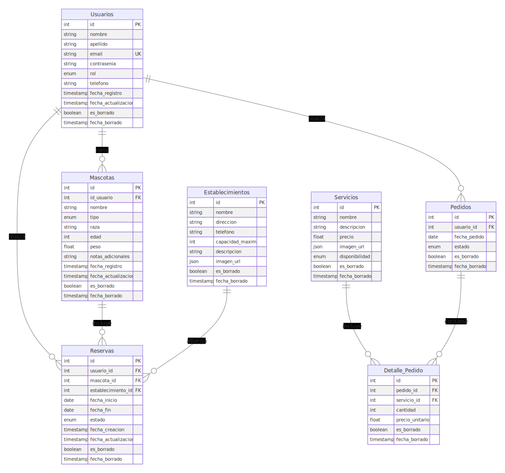
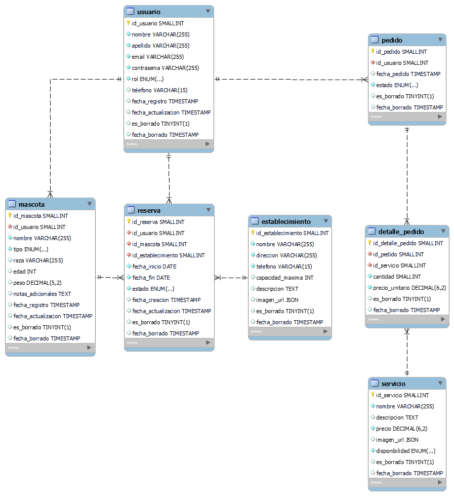

# Base de Datos - Pet Care

## Diagrama Entidad-Relación:

#### Diagrama



#### Entidades

- Usuarios
- Mascotas
- Reservas
- Establecimientos
- Servicios
- Pedidos
- Detalle_Pedido

#### Relaciones

- Un `Usuario` _tiene_ multiples `Mascotas`.
- Un `Usuario` _realiza_ multiples `Pedidos`.
- Un `Usuario` _realiza_ multiples `Reservas`.
- Una `Mascota` _incluye_ varias `Reservas`.
- Un `Establecimiento` _alberga_ varias `Reservas`.
- Un `Pedido` _contiene_ multiples `Servicios`.
- Un `Servicio` es _incluido_ en multiples `Pedidos`.

## Esquema en Mysql



## Script SQL

```sql

-- Creación de base de datos
DROP DATABASE IF EXISTS pet_care;
CREATE DATABASE IF NOT EXISTS pet_care;
USE pet_care;

-- Creación de tablas
DROP TABLE IF EXISTS usuario;
CREATE TABLE IF NOT EXISTS usuario (
	id_usuario SMALLINT UNSIGNED AUTO_INCREMENT,
    nombre VARCHAR(255) NOT NULL,
    apellido VARCHAR(255) NOT NULL,
    email VARCHAR(255) UNIQUE NOT NULL,
    contrasenia VARCHAR(255) NOT NULL,
    rol ENUM('admin', 'cliente') NOT NULL,
    telefono VARCHAR(15),
    fecha_registro TIMESTAMP DEFAULT CURRENT_TIMESTAMP,
    fecha_actualizacion TIMESTAMP DEFAULT CURRENT_TIMESTAMP ON UPDATE CURRENT_TIMESTAMP,
    es_borrado BOOLEAN DEFAULT FALSE,
    fecha_borrado TIMESTAMP,
    CONSTRAINT pk_usuario
		PRIMARY KEY(id_usuario)
);

DROP TABLE IF EXISTS mascota;
CREATE TABLE IF NOT EXISTS mascota (
    id_mascota SMALLINT UNSIGNED AUTO_INCREMENT,
    id_usuario SMALLINT UNSIGNED NOT NULL,
    nombre VARCHAR(255) NOT NULL,
    tipo ENUM('perro', 'gato', 'otro') NOT NULL,
    raza VARCHAR(255),
    edad INT,
    peso DECIMAL(5, 2),
    notas_adicionales TEXT,
    fecha_registro TIMESTAMP DEFAULT CURRENT_TIMESTAMP,
    fecha_actualizacion TIMESTAMP DEFAULT CURRENT_TIMESTAMP ON UPDATE CURRENT_TIMESTAMP,
    es_borrado BOOLEAN DEFAULT FALSE,
    fecha_borrado TIMESTAMP,
    CONSTRAINT pk_mascota
		PRIMARY KEY(id_mascota),
	CONSTRAINT fk_mascota_usuario
		FOREIGN KEY (id_usuario) REFERENCES usuario(id_usuario)
);

DROP TABLE IF EXISTS establecimiento;
CREATE TABLE IF NOT EXISTS establecimiento (
    id_establecimiento SMALLINT UNSIGNED AUTO_INCREMENT,
    nombre VARCHAR(255) NOT NULL,
    direccion VARCHAR(255) NOT NULL,
    telefono VARCHAR(15) NOT NULL,
    capacidad_maxima INT,
    descripcion TEXT,
    imagen_url JSON,
    es_borrado BOOLEAN DEFAULT FALSE,
    fecha_borrado TIMESTAMP,
    CONSTRAINT pk_establecimiento
		PRIMARY KEY(id_establecimiento)
);

DROP TABLE IF EXISTS reserva;
CREATE TABLE IF NOT EXISTS reserva (
    id_reserva SMALLINT UNSIGNED AUTO_INCREMENT,
    id_usuario SMALLINT UNSIGNED NOT NULL,
    id_mascota SMALLINT UNSIGNED NOT NULL,
    id_establecimiento SMALLINT UNSIGNED NOT NULL,
    fecha_inicio DATE NOT NULL,
    fecha_fin DATE NOT NULL,
    estado ENUM('pendiente', 'confirmada', 'cancelada') NOT NULL,
    fecha_creacion TIMESTAMP DEFAULT CURRENT_TIMESTAMP,
    fecha_actualizacion TIMESTAMP DEFAULT CURRENT_TIMESTAMP ON UPDATE CURRENT_TIMESTAMP,
    es_borrado BOOLEAN DEFAULT FALSE,
    fecha_borrado TIMESTAMP,
    CONSTRAINT pk_reserva
		PRIMARY KEY(id_reserva),
    CONSTRAINT fk_reserva_usuario
		FOREIGN KEY (id_usuario) REFERENCES usuario(id_usuario),
	CONSTRAINT fk_reserva_mascota
		FOREIGN KEY (id_mascota) REFERENCES mascota(id_mascota),
	CONSTRAINT fk_reserva_establecimiento
		FOREIGN KEY (id_establecimiento) REFERENCES establecimiento(id_establecimiento)
);

DROP TABLE IF EXISTS servicio;
CREATE TABLE IF NOT EXISTS servicio (
    id_servicio SMALLINT UNSIGNED AUTO_INCREMENT,
    nombre VARCHAR(255) NOT NULL,
    descripcion TEXT,
    precio DECIMAL(6, 2) NOT NULL,
    imagen_url JSON,
    disponibilidad ENUM('disponible', 'no_disponible') NOT NULL,
    es_borrado BOOLEAN DEFAULT FALSE,
    fecha_borrado TIMESTAMP,
    CONSTRAINT pk_servicio
		PRIMARY KEY(id_servicio)
);

DROP TABLE IF EXISTS pedido;
CREATE TABLE IF NOT EXISTS pedido (
    id_pedido SMALLINT UNSIGNED AUTO_INCREMENT,
    id_usuario SMALLINT UNSIGNED NOT NULL,
    fecha_pedido TIMESTAMP DEFAULT CURRENT_TIMESTAMP,
    estado ENUM('pendiente', 'completado', 'cancelado') NOT NULL,
    es_borrado BOOLEAN DEFAULT FALSE,
    fecha_borrado TIMESTAMP,
    CONSTRAINT pk_pedido
		PRIMARY KEY(id_pedido),
	CONSTRAINT fk_pedido_usuario
		FOREIGN KEY (id_usuario) REFERENCES usuario(id_usuario)
);

DROP TABLE IF EXISTS detalle_pedido;
CREATE TABLE IF NOT EXISTS detalle_pedido (
    id_detalle_pedido SMALLINT UNSIGNED AUTO_INCREMENT,
    id_pedido SMALLINT UNSIGNED NOT NULL,
    id_servicio SMALLINT UNSIGNED NOT NULL,
    cantidad SMALLINT NOT NULL,
    precio_unitario DECIMAL(6, 2) NOT NULL,
    es_borrado BOOLEAN DEFAULT FALSE,
    fecha_borrado TIMESTAMP,
    CONSTRAINT pk_detalle_pedido
		PRIMARY KEY(id_detalle_pedido),
	CONSTRAINT fk_detalle_pedido_pedido
		FOREIGN KEY (id_pedido) REFERENCES pedido(id_pedido),
	CONSTRAINT fk_detalle_pedido_servicio
    FOREIGN KEY (id_servicio) REFERENCES servicio(id_servicio)
);

-- Inserción de usuarios en la tabla "usuario"
INSERT INTO usuario (nombre, apellido, email, contrasenia, rol, telefono)
VALUES
('Juan', 'Perez', 'juan.perez@hotmail.com', 'password123', 'cliente', '3001234567'),
('Maria', 'Garcia', 'maria.garcia@gmail.com', 'micontraseña', 'cliente', '3101234567'),
('Carlos', 'Rodriguez', 'carlos.rodriguez@hotmail.com', 'contraseña123', 'cliente', '3201234567'),
('Laura', 'Martinez', 'laura.martinez@gmail.com', 'laurita123', 'cliente', '3012345678'),
('Luis', 'Gomez', 'luis.gomez@hotmail.com', 'pepito5678', 'cliente', '3112345678'),
('Ana', 'Mejía', 'ana.mejia@gmail.com', 'anaMejia456', 'cliente', '3215678901'),
('Fernando', 'Torres', 'fernando.torres@hotmail.com', '2023007', 'cliente', '3023456789'),
('Sandra', 'Sanchez', 'sandra.sanchez@gmail.com', '4598sanchez', 'admin', '3123456789'),
('Jorge', 'Ramirez', 'jorge.ramirez@hotmail.com', 'jr345622', 'admin', '3223456789'),
('Lucia', 'Diaz', 'lucia.diaz@gmail.com', '27772Lucia', 'admin', '3034567890'),
('Diego', 'Paredes', 'diego.paredes@hotmail.com', 'paredes123', 'cliente', '3234567891'),
('María', 'Cárdenas', 'maria.cardenas@hotmail.com', 'mariaC1989', 'cliente', '3109876543'),
('José', 'Gómez', 'jose.gomez@hotmail.com', 'gomez2023', 'cliente', '3134567890'),
('Camila', 'Torres', 'camila.torres@hotmail.com', 'camiTorres99', 'cliente', '3223456789'),
('Sofía', 'Vargas', 'sofia.vargas@gmail.com', 'sofiaV2023', 'cliente', '3102345678');
('Carlos', 'Rodríguez', 'carlos.rodriguez@hotmail.com', 'carlos123', 'cliente', '3112345678'),
('María', 'Pérez', 'maria.perez@hotmail.com', 'maria1987', 'cliente', '3123456789'),
('José', 'Gómez', 'jose.gomez@hotmail.com', 'gomez2023', 'cliente', '3134567890'),
('Ana', 'López', 'ana.lopez@hotmail.com', 'anaLopez!', 'cliente', '3201234567'),
('Luis', 'Martínez', 'luis.martinez@hotmail.com', 'luis_3000', 'cliente', '3212345678'),
('Camila', 'Torres', 'camila.torres@hotmail.com', 'camiTorres99', 'cliente', '3223456789'),
('Jorge', 'Ramírez', 'jorge.ramirez@hotmail.com', 'ramirez1980', 'cliente', '3234567890'),
('Diego', 'Hernández', 'diego.hernandez@outlook.com', 'diego987', 'cliente', '3101234567'),
('Sofía', 'Vargas', 'sofia.vargas@outlook.com', 'sofia2001', 'cliente', '3102345678'),
('Lucía', 'Salazar', 'lucia.salazar@outlook.com', 'luciaSalazar#', 'cliente', '3103456789'),
('Miguel', 'Castro', 'miguel.castro@gmail.com', 'miguelito!', 'cliente', '3104567890'),
('Fernanda', 'Guzmán', 'fernanda.guzman@gmail.com', 'fernanda93', 'cliente', '3105678901'),
('Andrés', 'Morales', 'andres.morales@gmail.com', 'andres_1234', 'cliente', '3106789012'),
('Natalia', 'Ríos', 'natalia.rios@gmail.com', 'rios2000', 'cliente', '3107890123'),
('Esteban', 'Álvarez', 'esteban.alvarez@gmail.com', 'esteban77', 'cliente', '3108901234');
/*Cración de usuarios*/
INSERT INTO usuario (nombre, apellido, email, contrasenia, rol, telefono)
VALUES

/*consultar datos*/
select * from mascota;

/*Creación de mascotas por usuario*/
INSERT INTO mascota (id_usuario, nombre, tipo, raza, edad, peso, notas_adicionales)
VALUES
-- Mascotas para usuarios "cliente"
(1, 'Michi', 'gato', 'Criollo', 3, 4.5, 'Le gusta dormir todo el día'),
(2, 'Firulais', 'perro', 'Labrador', 5, 25.0, 'Es muy juguetón'),
(3, 'Nala', 'gato', 'Criollo', 2, 3.8, 'Es muy cariñosa'),
(4, 'Rocky', 'perro', 'Beagle', 4, 20.0, 'Le encanta correr al aire libre'),
(5, 'Simba', 'gato', 'Persa', 1, 4.0, 'Tiene un pelaje muy largo'),
(6, 'Max', 'perro', 'Golden Retriever', 6, 30.0, 'Es muy amigable con los niños'),
(7, 'Luna', 'perro', 'Bulldog', 3, 22.0, 'Le gusta mucho comer'),
-- Mascotas para usuarios "admin"
(8, 'Charlie', 'perro', 'Poodle', 2, 7.5, 'Es muy inteligente'),
(9, 'Roro', 'otro', 'tortuga', 10, 1.2, 'Es muy tranquila'),
(10, 'Pepito', 'otro', 'periquito', 1, 0.05, 'Canta todas las mañanas');

-- Inserción de servicios en la tabla "servicio"
INSERT INTO servicio (nombre, descripcion, precio, imagen_url, disponibilidad, es_borrado)
VALUES
('Cuidador', 'Persona que presta servicios de cuidado básico para mascotas.', 50.00, '', 'disponible', FALSE),
('Cuidador', 'Persona que presta servicios de cuidado especializado para mascotas con necesidades específicas.', 75.00, '', 'no_disponible', FALSE),
('Paseador', 'Persona que presta servicios de paseo diario para perros.', 30.00, '', 'disponible', FALSE),
('Paseador', 'Persona que presta servicios de paseo diario para perros.', 45.00, '', 'no_disponible', FALSE),
('Veterinario', 'Persona que presta servicios veterinarios de consulta general.', 60.00, '', 'disponible', FALSE),
('Veterinario', 'Persona que presta servicios de atención veterinaria de emergencias.', 100.00, '', 'no_disponible', FALSE),
('Peluquero', 'Persona que presta servicios de peluquería estándar para mascotas.', 40.00, '', 'disponible', FALSE),
('Peluquero', 'Persona que presta servicios de peluquería especializada en razas exóticas.', 60.00, '', 'no_disponible', FALSE),
('Experto en Mudanzas con mascotas', 'Persona que presta servicios de ayuda en mudanzas con mascotas.', 120.00, '', 'disponible', FALSE),
('Experto en Mudanzas con mascotas', 'Persona que presta servicios de ayuda en mudanzas con mascotas.', 90.00, '', 'no_disponible', FALSE),
('Experto en Control de Estrés', 'Persona que presta servicios para reducir el estrés en mascotas.', 70.00, '', 'disponible', FALSE),
('Experto en Alimentación', 'Persona que presta servicios de asesoramiento nutricional para mascotas.', 85.00, '', 'no_disponible', FALSE),
('Experto en Alimentación', 'Persona que presta servicios de asesoramiento nutricional para mascotas.', 55.00, '', 'disponible', FALSE),
('Experto en Alimentación', 'Persona que presta servicios de asesoramiento nutricional para mascotas.', 80.00, '', 'no_disponible', FALSE),
('Experto en Alimentación', 'Persona que presta servicios de asesoramiento nutricional para mascotas.', 100.00, '', 'disponible', FALSE);

```
